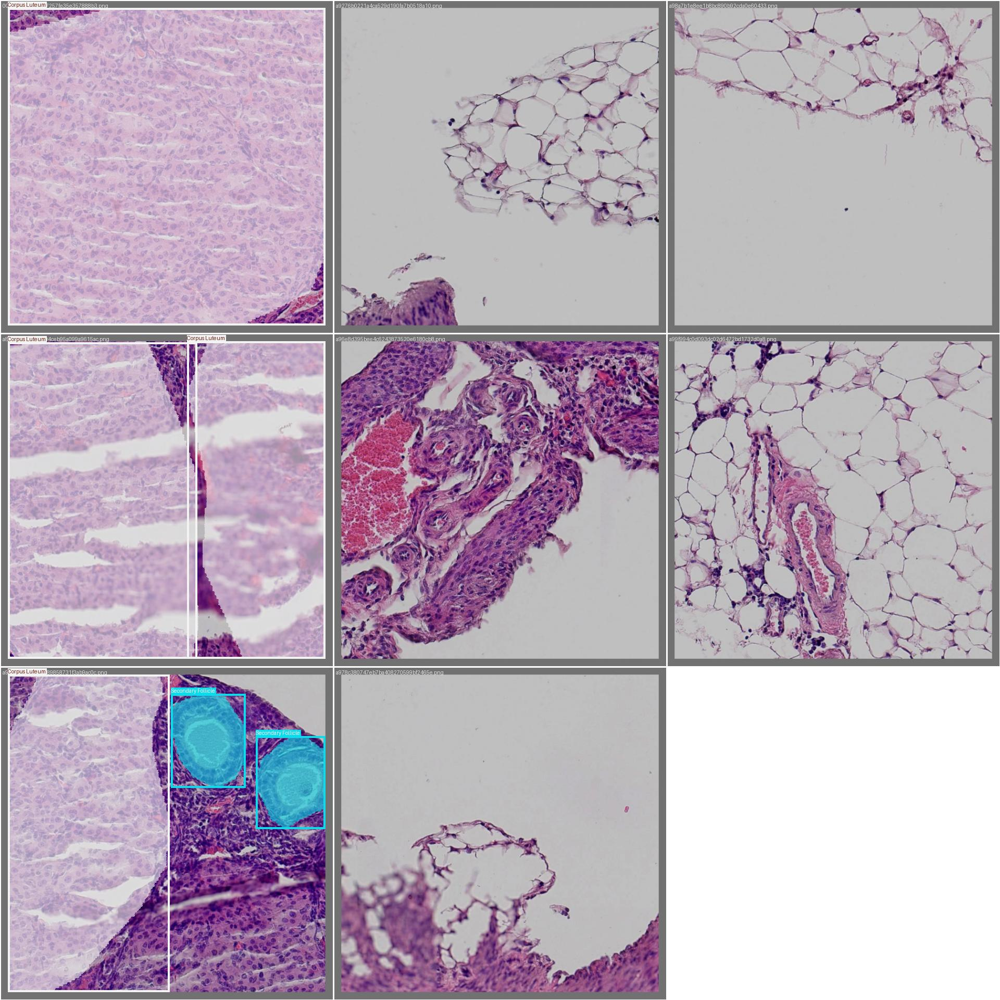
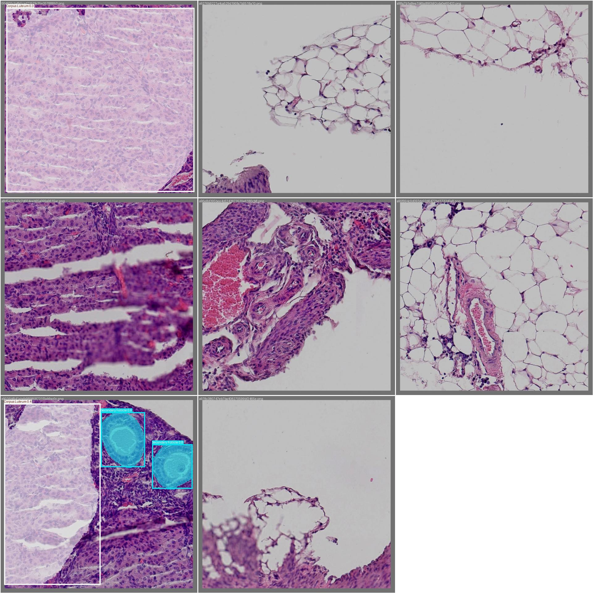
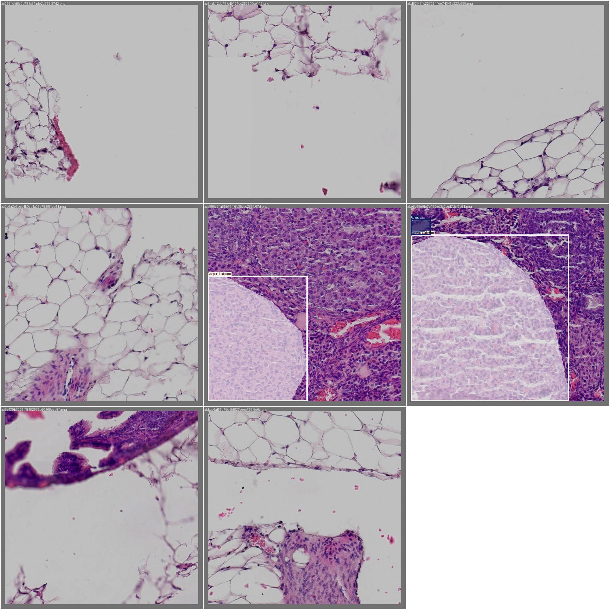
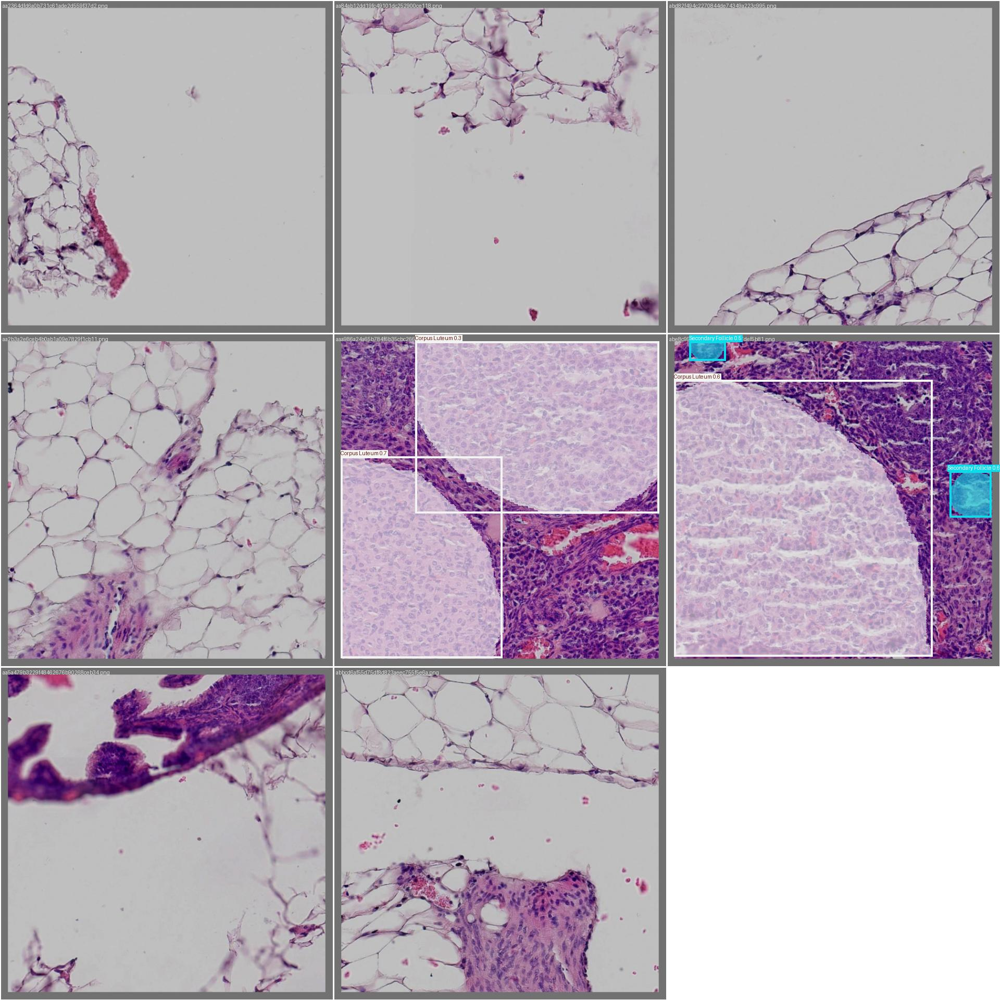
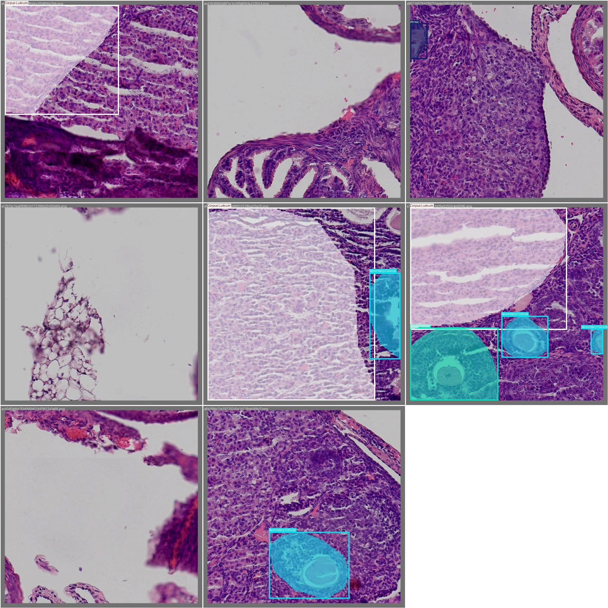

# High-Performance Medical Object Detection via a YOLOv8-based CNN Model Engineered by Data Augmentation and Active Learning

I engineered a high-performance histological analysis tool using YOLOv8, optimizing model accuracy through data augmentation and implementing Active Learning to combat overfitting and streamline the labeling process. Briefly,
- I used a sliding window approach for data augmentation to handle high-resolution images or small objects
- Initially trained YOLOV8 model shows overfitting (high variance): high performance on training data but low performance on testing data
- I performed Active Learning by focusing on the “weakest” labels and adding more targeted data
- I eventually, obtained a high-performance model

The github and blog will be composed soon, but let us preview the beautiful predictions made by our trained model-- **it shows even higher robustness than human scientists in labeling**

## Result 1: The Trained Model Successfully Labelled All Follicles and Rejected non-follicular structures That Were Initially Misidentified as Follicles (False Positives) by Human Scientists

#### The Annotation by Human Scientists with Misidentified Non-Follicular Structures (False Positives):

  <a href="" target="_blank">
    
     
    <em></em>
  </a>

#### The Prediction by The Trained Model:

  <a href="" target="_blank">
    
     
    <em></em>
  </a>

## Result 2: The Trained Model Successfully Labelled All Follicles Including Those Overlooked by Human Scientists

#### Human Scientists Overlooked Several Follicles (False Negatives):

  <a href="" target="_blank">
    
     
    <em></em>
  </a>

#### The Trained Model Successfully Predicted All Follicles Found by Human Scientists and Those Overlooked by Human Scientists:

  <a href="" target="_blank">
    
     
    <em></em>
  </a>

## Result 3: The Trained Model Successfully Labelled All Follicles and Rejected non-follicular structures That Were Initially Misidentified as Follicles (False Positives) by Human Scientists

> This result combined with the Result 1 included follicles of all stages.

#### The Annotation by Human Scientists with Misidentified Non-Follicular Structures (False Positives):

  <a href="" target="_blank">
    
     
    <em></em>
  </a>

#### The Prediction by The Trained Model:

  <a href="" target="_blank">
    
     
    <em></em>
  </a>

